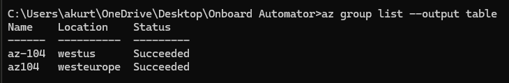

# Onboard-Automator

---
    title: 'VM Fleet Commander'
    module: 'Deploying and managing Azure compute resources'
---
## Project introduction
Implement an infrastructure-as-code approach to provision and manage virtual machines in Azure, using ARM templates and Bicep

## Azure Resources Used
+ Azure Virtual Machines
+ Azure Resource Manager (ARM)
+ Bicep
+ Azure CLI

## Important

![My Bicep File]: https://github.com/akurtic1/Onboard-Automator/blob/c239bed969de09bab87244fbe69e929d3641bd2b/main.bicep

## Tasks - Step by Step

+ Task 1: Initial setup 

In this task I installed Azure CLI with Bicep Support.
I also set up a version control system (Git) to track changes in Bicep or ARM file.

+ Task 2: Basics

I went trough the syntax of the template.JSON to get more familiar with the file.
After that, I converted a template.JSON to bicep using Visual Studio Code -> Right Click on the JSON file -> decompile into Bicep.
I also reviewd the syntax of the bicep to get more familiar with the file.

+ Task 3: Resource Group and Naming Conventions

In this task, I used CLI to log in into my Azure account and create the resource group. I used this command: "az group create --name az-104 --location 'westeurope'
".

After this command, I checked if the resource is created successfully by typing the following commands: "az group list --output table"

+ Task 4: Building a Bicep File

#### Error 1
So, in this task I tried to build a Bicep file that will run the VM by executing the command in Azure CLi. I come up with different type of errors stating that I cannot deploy my VM.

After researching Microsoft Documentation, I edited my bicep file with all
parameters as it comes for the Network, Disk, VM...

#### Error 2
In this error, with my bicep file I was stuck on the screen stating "Running".
After seeing this, I went on Azure Portal to check the logs and to see if anything
was deployed. Vnet and Network interface are deployed but no other resources that I stated in bicep file.

I also forgot to add the "osProfile" so I also filled that part of my bicep file.
After various of errors, I successfully deployed the bicep file.

+ Task 5: Using loops in Bicep to deploy multiple VM instaces based on specific count.

In this task, I adjusted my main bicep file with the following parameters:
#### param instanceCount int = 3 // Number of VM instances to deploy

#### resource nic 'Microsoft.Network/networkInterfaces@2023-09-01' = [for index in range(0, instanceCount): {

After some time and a couple of errors, I managed to 
deploy 3 virtual machines with all other resources.

+ Task 6: Assigning a NSG (Network Security Group) and adding the
necessary security rules applied.

I added this code:

resource nsg 'Microsoft.Network/networkSecurityGroups@2023-09-01' = {
  name: 'myNSG'
  location: location
  properties: {
    securityRules: [
      {
        name: 'AllowSSH'
        properties: {
          protocol: 'Tcp'
          sourcePortRange: '*'
          destinationPortRange: '22'
          sourceAddressPrefix: '*'
          destinationAddressPrefix: '*'
          access: 'Allow'
          direction: 'Inbound'
          priority: 100
        }
      }
    ]
  }
}

+ Task 7: Creating separate parameter files for the bicep template, allowing
for different environment deployments (dev, test, prod)

In this task, I created a simple parameter files for the deployment with
different environment configurations. Within this task, I learned the new command to deploy template with parameters: 

+ az deployment group create --resource-group az-104 --template-file mai
n.bicep --parameters @dev.parameters.json

+ Task 8: Maintaining and Updates

In this task, I simply played with the bicep file, tried different deployments such as different Regions, SKUs, Disk Sizes...

I also tried adding some new and deleting existing things to
test if the bicep file would be still valid.

### Commands I learned in this project:

+ Deployment: az deployment group create --name MyDeployment --resource-group az-104 --template-file template.bicep 

+ Monitor the Deployment status: az deployment group show --name MyDeployment --resource-group az-104 --query properties.provisioningState

+ Validate a Bicep file: az bicep build --file template.bicep

+ az deployment group create --resource-group az-104 --template-file mai
n.bicep --parameters @dev.parameters.json
